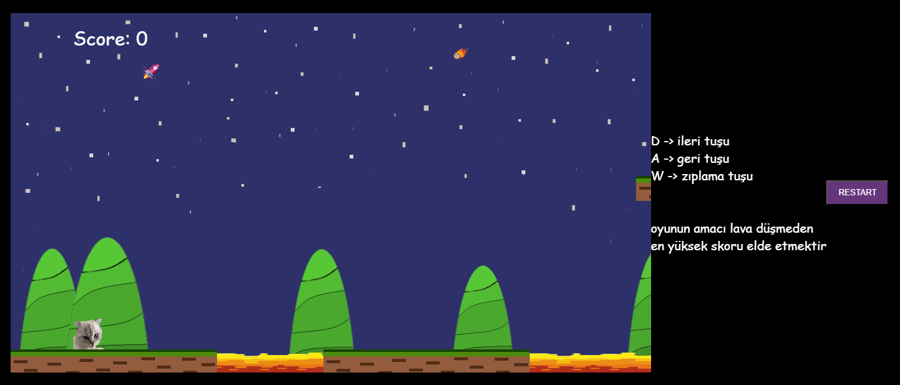
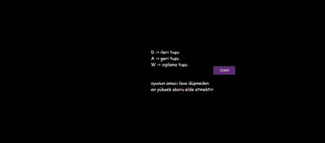

# Maya

Oyuna bu linkten ulaşabilirsiniz : **http://maya.orgfree.com**

## Giriş
"Maya", kullanıcılara benzersiz ve heyecan dolu bir oyun deneyimi sunmayı amaçlayan bir JavaScript oyunudur. Basit ama zorlu bu oyun, kullanıcılarına hızlı düşünme ve hızlı hareket etme yeteneklerini test etme fırsatı sunar.

## Oyunun Amacı
"Maya" oyununun temel amacı, yön tuşlarını kullanarak karakterinizi kontrol ederken lavlara düşmeden en yüksek skoru elde etmektir. Her bir hareket, oyuncunun skorunu artırır ve oyun, karakter lavlara düştüğünde sona erer. En yüksek skoru elde etmek için hızlı ve dikkatli olun!

## Nasıl Oynanır
1. Oyunu başlatın.
2. W-A-D tuşlarını kullanarak karakterinizi kontrol edin.
3. Lavlara düşmeden olabildiğince yüksek bir skor elde etmek için hızlı hareket edin.
4. Her bir hareket skorunuzu artırır, bu yüzden dikkatli olun ve hızlı düşünün!

## Kullanılan Programlama Dilleri
Bu oyun, yüksek performans ve kullanıcı deneyimini optimize etmek için JavaScript, HTML ve CSS programlama dilleri kullanılarak geliştirilmiştir. 

- **JavaScript**: Oyunun dinamik özelliklerini ve interaktifliğini sağlar.
- **HTML**: Oyunun temel yapısını oluşturur.
- **CSS**: Oyunun görünümünü ve stillerini belirler.

Bu üç dilin bir arada kullanımı, oyunun heyecan verici ve kullanıcı dostu bir deneyim sunmasını sağlar.
